# Adwenture Works | Modern Data Engineering Azure Project

## Introduction
This repository implements a full end-to-end data engineering pipeline on Azure, using Data Factory for orchestration, Data Lake Storage for raw data staging, Databricks with Apache Spark for transformation, and Synapse Analytics for warehousing.

## Architecture
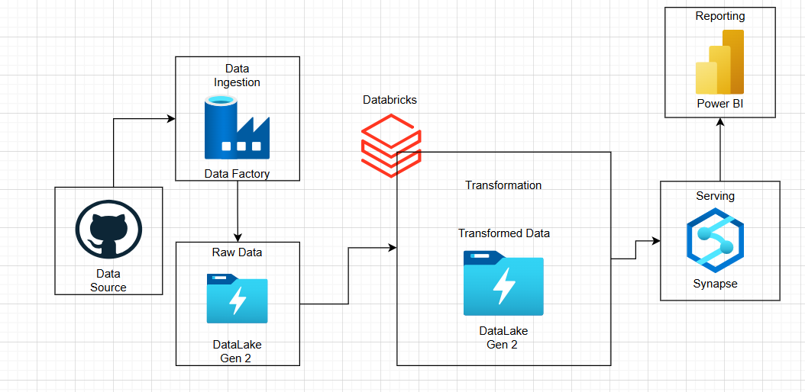

## Technology Used
1. Programming Language - Python
2. Scipting Language - SQL
3. Microsoft Azure Platform
   - Data Lake
   - Databricks
   - Data Factory
   - Synapse Analytics
 4. PowerBI

## Dataset Used
https://github.com/muratyardimci/adwenture-works-data-engineering-project/tree/main/Data

## Scripts For Project
https://github.com/muratyardimci/adwenture-works-data-engineering-project/tree/main/SyanpseSQL
https://github.com/muratyardimci/adwenture-works-data-engineering-project/blob/main/silver-layer%20.ipynb

# Implementation:

## Part 1: Data Ingestion
### 1. Create Resource Group
A resource group named 'awwproject' has been created. This allows us to effectively organize and manage our cloud resources.

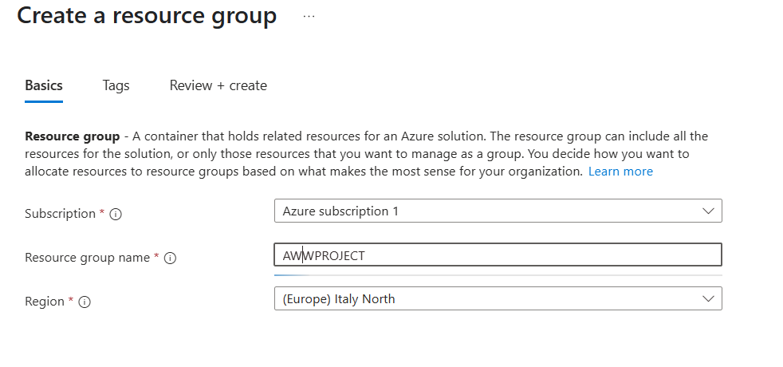

### 2. Create Hierarchical Blob Storage
a storage account created and making sure it has a hierarchical namespace, because we want to set up a data lake. If we don’t check this option, only a regular blob storage account is created. After that I created separate containers named Bronze, Silver, and Gold to store data at different stages of processing. This ensures a clear and organized workflow, from raw data (Bronze) to refined, vetted data (Gold)

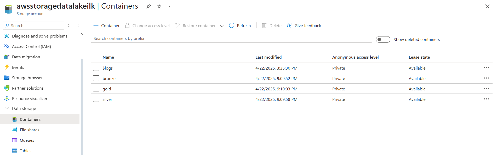

### 3. Create Azura Data Factory
I chose Azure Data Factory to easily orchestrate data movement and transformations. It lets us design pipelines for extracting, transforming, and loading data in a scalable, managed way.

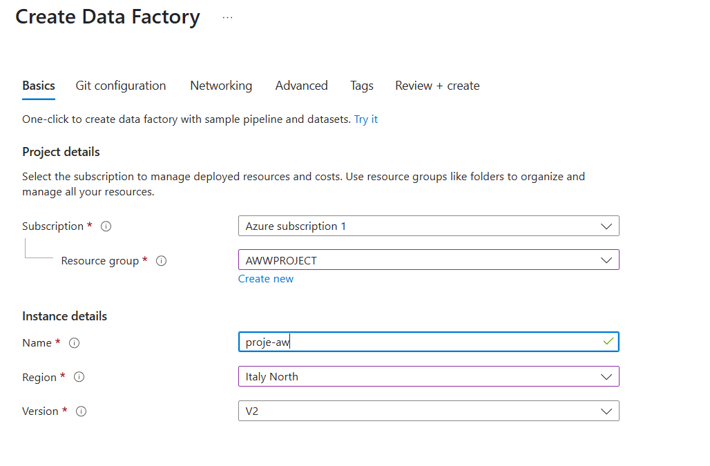

### 4. Create HTTP Linked Service
I created this linked service in Azure Data Factory to connect to a GitHub URL via HTTP. It uses anonymous authentication since the data is publicly accessible, allowing us to easily ingest and process this data in our pipelines.

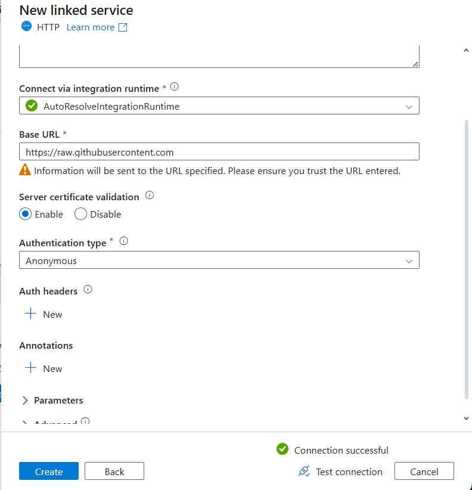

### 5. Create Data Lake Linked Service
I created this linked service to connect Azure Data Factory to my Azure Data Lake Storage Gen2 account, allowing secure read and write operations to the containers using the account key.

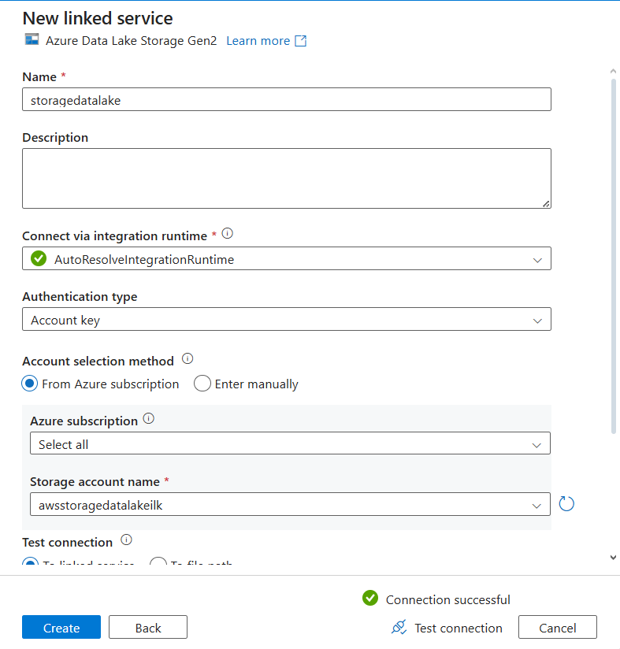

### 6. Create Dataset To Read Data From GitHub
I created this dataset to read data from GitHub through the HTTP linked service. The ‘Relative URL’ points to the specific path, and I set the first row as the header to ensure proper column recognition.

### 7. Create Dataset To Read Data From Bronze Layer
I created this dataset to read the ‘products.csv’ file from the ‘bronze’ container path. The first row is treated as the header, so column names are automatically recognized from the file.

-datalake-link-added.png)

### 8. Products Data Preview

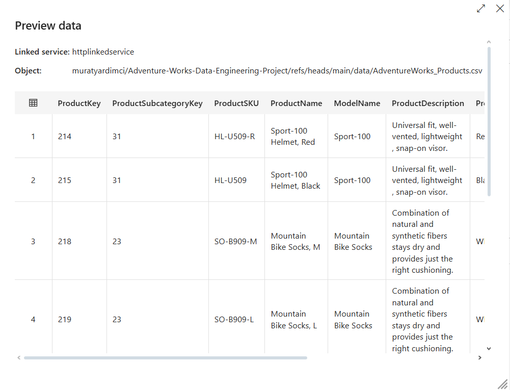

### 9. Debugging ETL

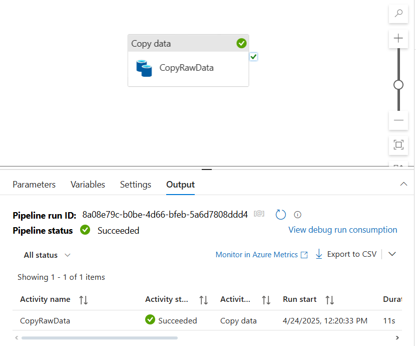

### 10. Building Dynamic Pipeline
I created new pipeline and I defined three parameters to make my pipeline fully dynamic:
1. p_rel_url to specify the GitHub file path,
2. p_sink_folder to determine the target folder in Data Lake,
3. p_file_name to set the output file name.
This allows me to handle various files without manually changing each dataset or activity.

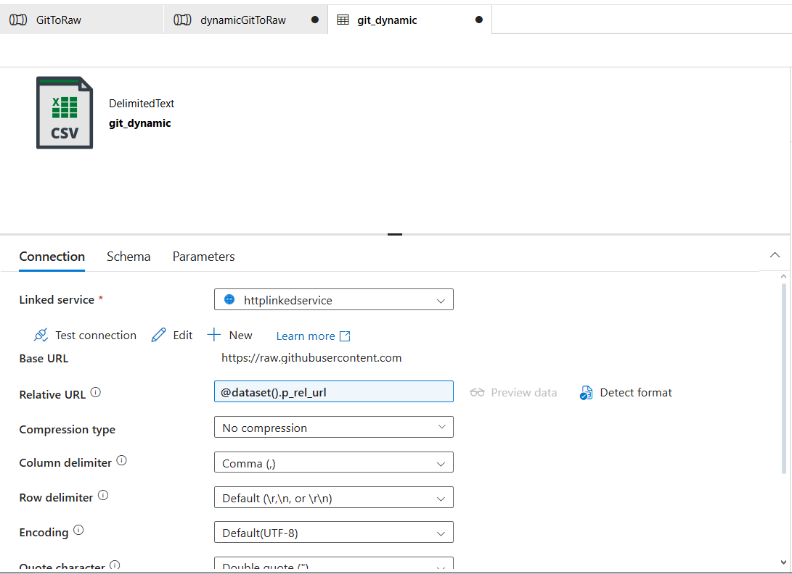

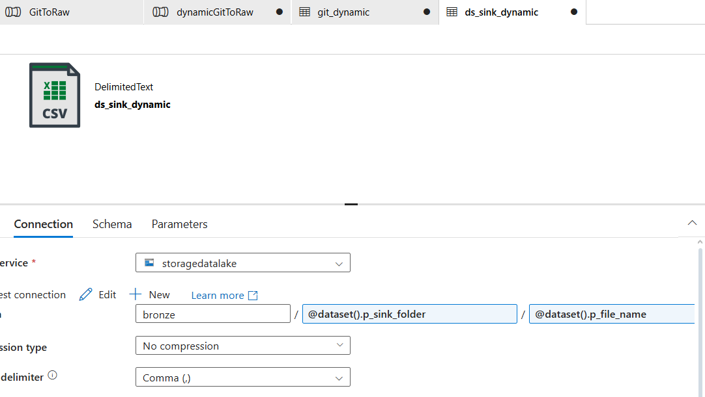

### 11. Creating Values For Key Parameters
I used a ForEach activity to iterate over a dynamic list of files. The ‘Items’ property is parameterized so I can pass in an array of file paths or object metadata, allowing the pipeline to loop through each item without manually configuring multiple activities.

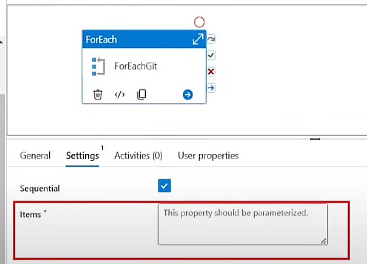

Next, I wrote the script and uploaded it to that folder for easy reuse in my pipeline. Then I created a ‘parameters’ folder in the data lake to store the iteration script.

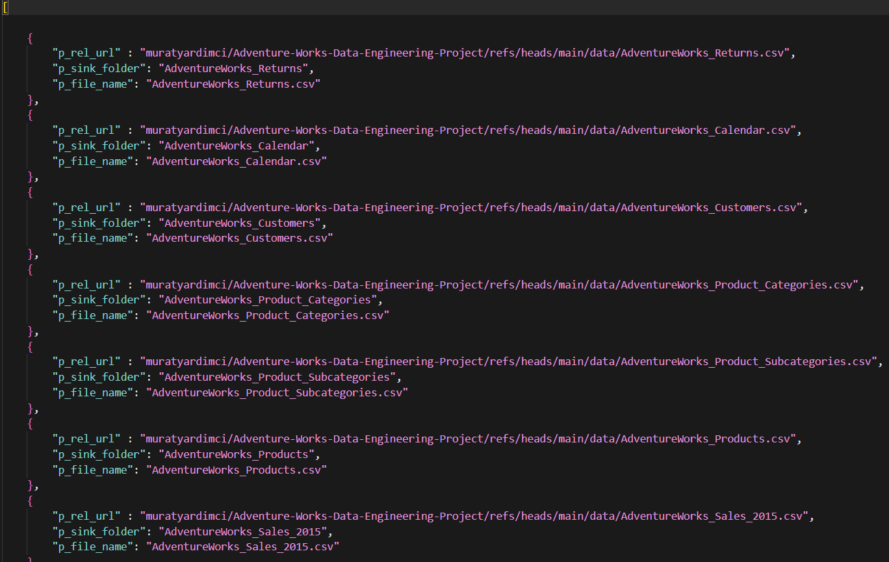

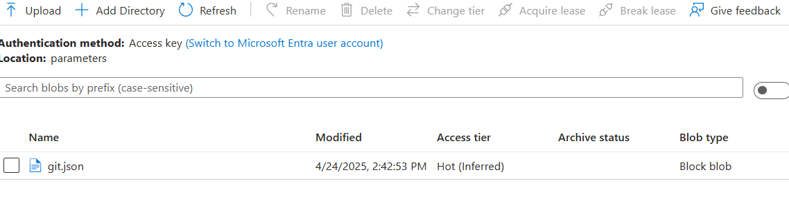

### 12. Using Lookup Output to Drive a ForEach Loop
I set the ForEach Items property to '@activity("LookupGit").output.value' so each row returned by the LookupGit activity can be iterated on without manual intervention.

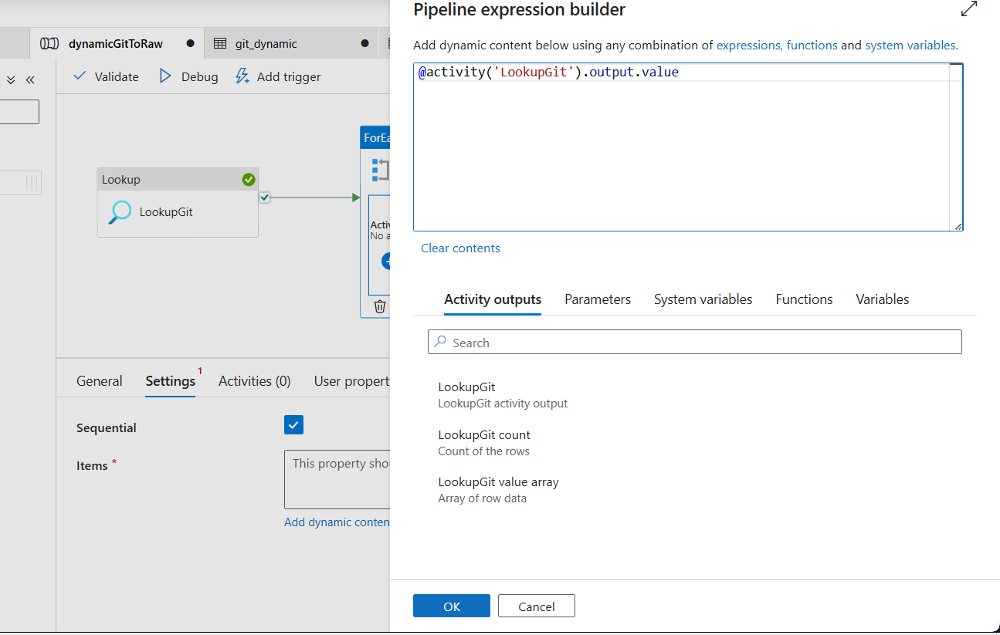

I used a LookupGit activity to retrieve a list of items, and my ForEach loop iterated through each one, triggering a 'dynamicCopy' operation. As shown in the output, every Copy Data activity succeeded, confirming that my loop and parameters worked correctly.

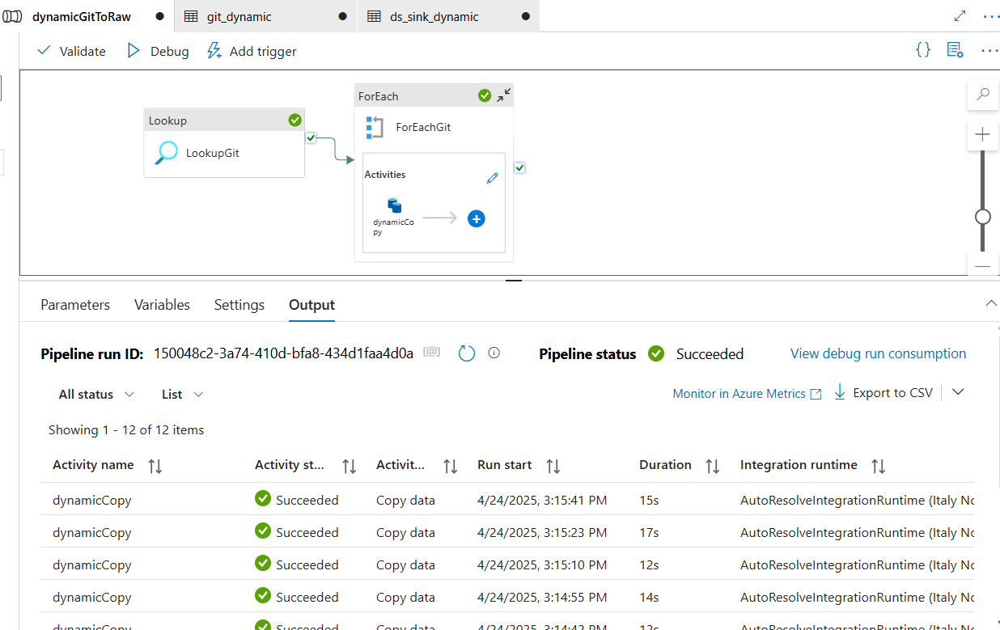

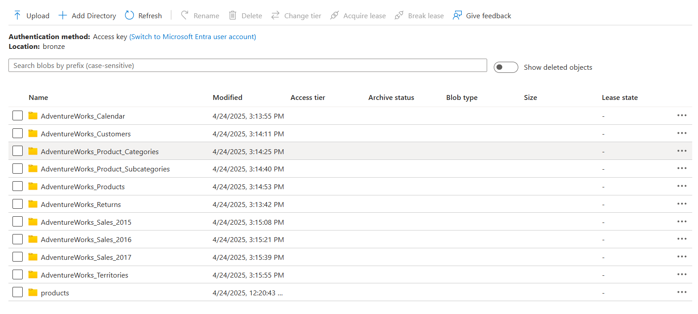

