# Adwenture Works | Modern Data Engineering Azure Project

## Introduction
This repository implements a full end-to-end data engineering pipeline on Azure, using Data Factory for orchestration, Data Lake Storage for raw data staging, Databricks with Apache Spark for transformation, and Synapse Analytics for warehousing.

## Architecture

## Technology Used
1. Programming Language - Python
2. Scipting Language - SQL
3. Microsoft Azure Platform
   - Data Lake
   - Databricks
   - Data Factory
   - Synapse Analytics
 4. PowerBI

## Dataset Used
https://github.com/muratyardimci/adwenture-works-data-engineering-project/tree/main/Data

## Scripts For Project
https://github.com/muratyardimci/adwenture-works-data-engineering-project/tree/main/SyanpseSQL
https://github.com/muratyardimci/adwenture-works-data-engineering-project/blob/main/silver-layer%20.ipynb

# Implementation(Bronze Layer):

## Part 1: Data Ingestion
### 1. Create Resource Group
A resource group named 'awwproject' has been created. This allows us to effectively organize and manage our cloud resources.

### 2. Create Hierarchical Blob Storage
a storage account created and making sure it has a hierarchical namespace, because we want to set up a data lake. If we don’t check this option, only a regular blob storage account is created. After that I created separate containers named Bronze, Silver, and Gold to store data at different stages of processing. This ensures a clear and organized workflow, from raw data (Bronze) to refined, vetted data (Gold)

### 3. Create Azura Data Factory
I chose Azure Data Factory to easily orchestrate data movement and transformations. It lets us design pipelines for extracting, transforming, and loading data in a scalable, managed way.

### 4. Create HTTP Linked Service
I created this linked service in Azure Data Factory to connect to a GitHub URL via HTTP. It uses anonymous authentication since the data is publicly accessible, allowing us to easily ingest and process this data in our pipelines.

### 5. Create Data Lake Linked Service
I created this linked service to connect Azure Data Factory to my Azure Data Lake Storage Gen2 account, allowing secure read and write operations to the containers using the account key.

### 6. Create Dataset To Read Data From GitHub
I created this dataset to read data from GitHub through the HTTP linked service. The ‘Relative URL’ points to the specific path, and I set the first row as the header to ensure proper column recognition.

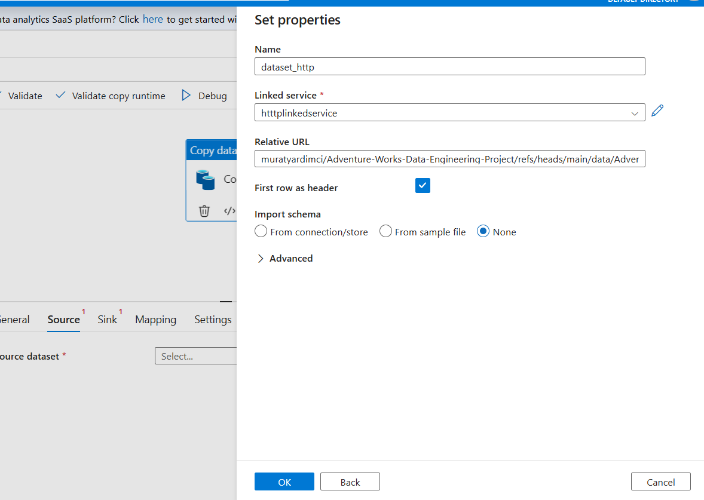

### 7. Create Dataset To Read Data From Bronze Layer
I created this dataset to read the ‘products.csv’ file from the ‘bronze’ container path. The first row is treated as the header, so column names are automatically recognized from the file.

-datalake-link-added.png)

### 8. Products Data Preview

### 9. Debugging ETL

### 10. Building Dynamic Pipeline
I created new pipeline and I defined three parameters to make my pipeline fully dynamic:
1. p_rel_url to specify the GitHub file path,
2. p_sink_folder to determine the target folder in Data Lake,
3. p_file_name to set the output file name.
This allows me to handle various files without manually changing each dataset or activity.

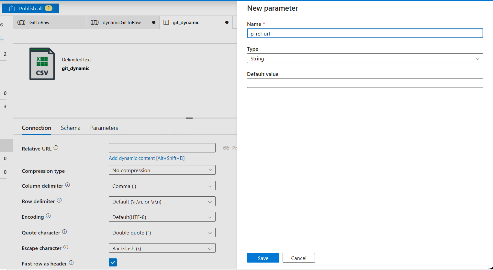

### 11. Creating Values For Key Parameters
I used a ForEach activity to iterate over a dynamic list of files. The ‘Items’ property is parameterized so I can pass in an array of file paths or object metadata, allowing the pipeline to loop through each item without manually configuring multiple activities.

Next, I wrote the script and uploaded it to that folder for easy reuse in my pipeline. Then I created a ‘parameters’ folder in the data lake to store the iteration script.

### 12. Using Lookup Output to Drive a ForEach Loop
I set the ForEach Items property to '@activity("LookupGit").output.value' so each row returned by the LookupGit activity can be iterated on without manual intervention.

I used a LookupGit activity to retrieve a list of items, and my ForEach loop iterated through each one, triggering a 'dynamicCopy' operation. As shown in the output, every Copy Data activity succeeded, confirming that my loop and parameters worked correctly.

# Transformation(Silver Layer):
I moved on to the Silver layer, where I’m setting up an Azure Databricks workspace to transform and refine my raw data. This step cleans, validates, and enriches the data, making it ready for further analysis.

### 1. Creating Databricks

### 2. Creating Cluster

### 3. App Registrations
I created an Azure AD app registration named ‘awproject_app’ to handle authentication in my solution. This registration provides a Client (Application) ID and Tenant ID, enabling secure access and permissions for my Azure resources.

### 4. Client Secrets
This client secret is used by the Azure AD application to securely authenticate and request access tokens. It ensures only authorized applications can call the services and operate on protected data within Azure.

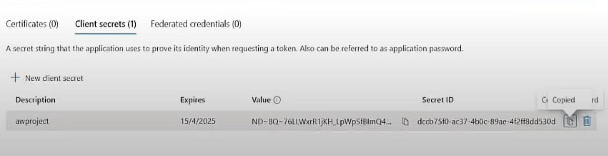

### 5. Adding Role
I assign the ‘awproject_app’ service principal the ‘Storage Blob Data Contributor’ role so it can securely read and write data in the Azure Data Lake. This integration ensures our automated pipelines (Data Factory, Databricks, etc.) have the necessary permissions to manage data across Bronze, Silver, and Gold layers.

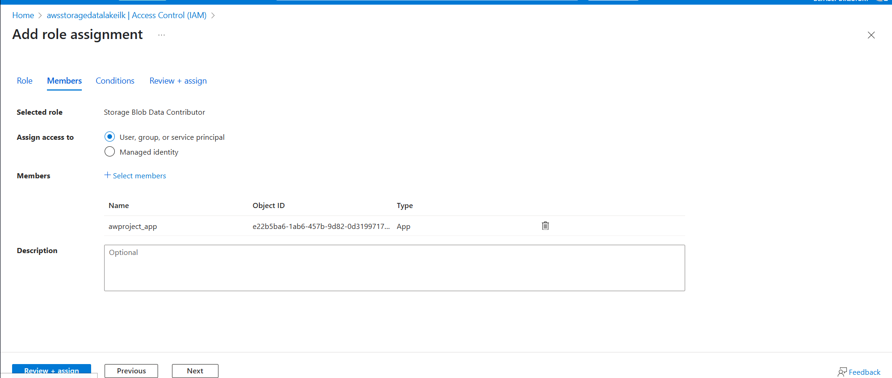

### 6. Connecting To Azure Data Lake Storage Gen 2 Script
I configure Spark to authenticate Databricks against Azure Data Lake using my registered application credentials. I rely on the ClientCredsTokenProvider to handle OAuth token requests, allowing me to securely read and write data to the Silver layer.

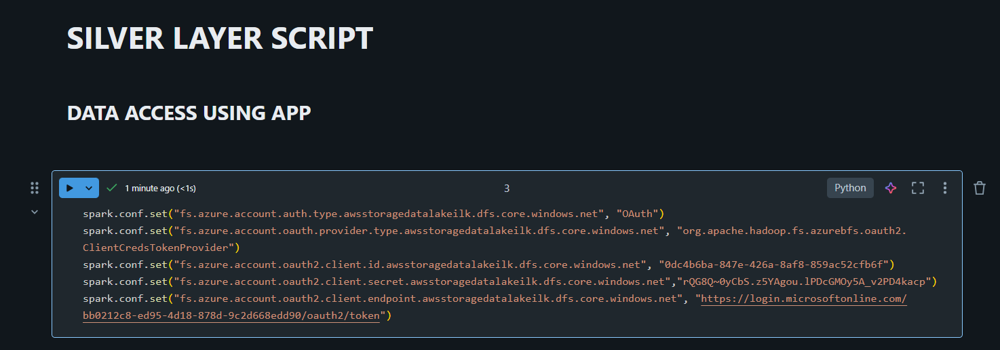

### 7. Reading and Loading Data
I load the raw AdventureWorks CSV files from the Bronze container into Spark DataFrames, enabling header and inferSchema so I automatically capture column names and data types. These DataFrames form the input I will cleanse, enrich, and write to the Silver layer.

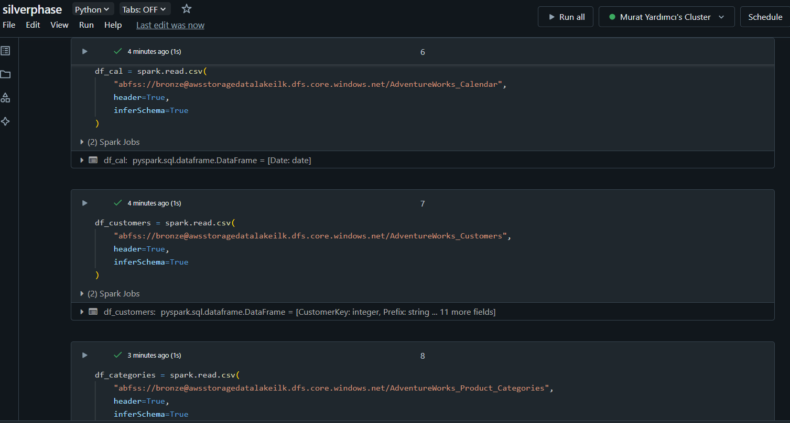

### 8. Transforming Data
I show only one transformation. You can look at the Jupyter Notebook to see all transformations.
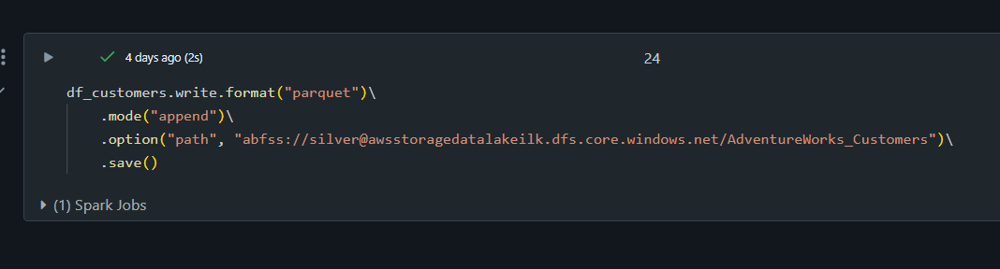

# Gold Layer:

### 1. Creating Azure Synapse Analytics

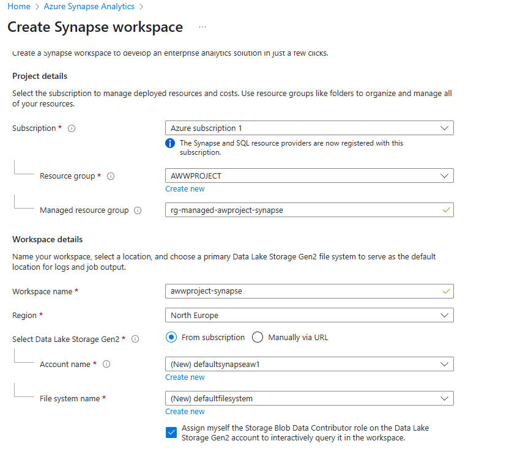

### 2. Adding Role Assignment
I grant my Synapse workspace’s managed identity the Storage Blob Data Contributor role so I can read and write lake data from Synapse without storing any secrets.. I choose a managed identity because it lets Synapse authenticate to the Data Lake with Azure-issued tokens, so I avoid hard-coding client IDs or secrets and get simpler, safer, and fully automated credential management

.png)

### 3. Creating Database
I created a serverless SQL database called awdatabase inside my Synapse workspace so I can run ad-hoc SQL over the files sitting in the lake. With the serverless pool I pay only for the queries I execute, keep zero dedicated compute running, and still expose data through external tables, views, and security objects. This lets me explore the Bronze/Silver/Gold layers with standard T-SQL while relying on the workspace’s managed identity for secure lake access.

### 4. Creating Schema
I created a gold schema to hold my curated, presentation-ready tables and keep them separated from other layers.

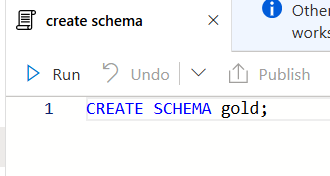

### 5. Creating Views
I define gold-layer views that query my Silver Parquet files with OPENROWSET, letting me expose curated data sets in SQL without copying anything out of the lake.

### 6. Creating Master Key
I create a database master key so I can later store external-data credentials securely within the serverless SQL database.

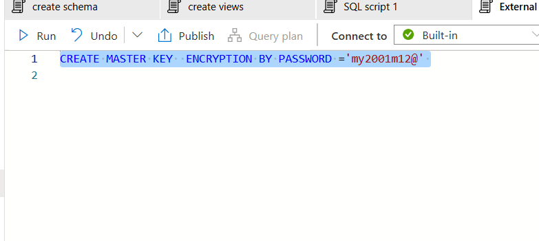

### 7. Creating Database-Scoped Credential
I create a database-scoped credential (cred_murat) that binds my serverless SQL database to the workspace’s managed identity, letting me authenticate external data sources without storing keys or passwords.

### 8. Creating Data Sources
I register external data sources for the Silver and Gold folders, map them to my managed-identity credential (cred_murat), and define a Snappy-compressed Parquet file format so I can create external tables over lake data with simple T-SQL.

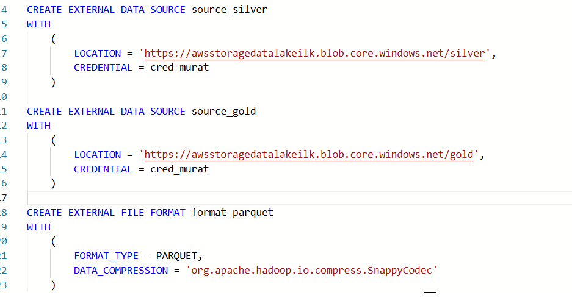

### 9. Creating External Tables
I define the external tables like gold.extsales, instructing Synapse to persist the contents of gold.sales as Snappy-compressed Parquet files under the extsales folder in the Gold area. This lets me query or share the sales data via standard T-SQL while the data continues to reside natively in the lake.

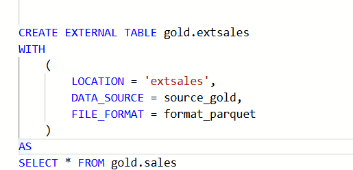

### PowerBI

I copy the serverless SQL endpoint so I can connect from SSMS, Azure Data Studio, or Power BI and run pay-per-query SQL against my lake without deploying any dedicated compute.

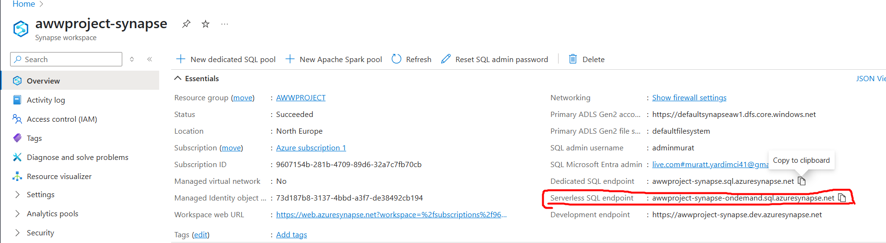

I paste the serverless SQL endpoint into Power BI’s SQL Server connector so I can query my Synapse Gold views and external tables directly from Power BI for reporting.

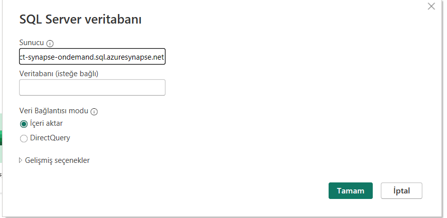

Finally, I build a Power BI dashboard that queries my Synapse Gold views, plots yearly order and customer counts, and highlights total customers with a KPI card so I can validate the data pipeline and share business-ready insights.

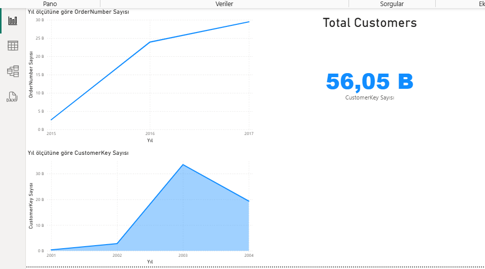

